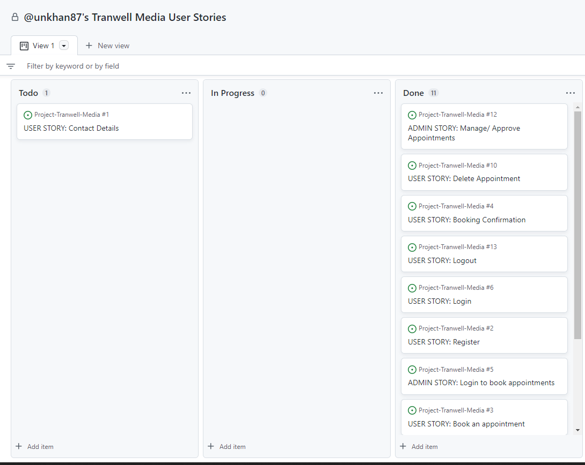

# Restaurant Booking System

## Introduction
Welcome to my fourth project. This project is a simple appointment booking system for a Marketing that allows clients to book appointment with the agency. This will use languages such as Django, Python, HTML, CSS and JavaScript.

This project will show the use of CRUD functionality (Create, Read, Update, Delete). The user will be able create, read, update and delete their appoinmenta.

A live website can be found [here](https://top-chef-kelvin.herokuapp.com/).


# Table of Contents

-   [1. UX](#ux)
    -   [1.1. Strategy](#strategy)
        -   [Project Goals](#project-goals)
            -   [User Goals:](#user-goals)
            -   [User Expectations:](#user-expectations)
            -   [Trends of Modern Websites](#trends-of-modern-websites)
            -   [Strategy Table](#strategy-table)
    -   [1.2. Structure](#structure)
    -   [1.3. Skeleton](#skeleton)
    -   [1.4. Surface](#surface)
-   [2. Features](#features)
-   [3. Technologies Used](#technologies-used)
-   [4. Testing](#testing)
-   [5. Development Cycle](#development-cycle)
-   [6. Deployment](#deployment)
-   [7. End Product](#end-product)
-   [8. Known Bugs](#known-bugs)
-   [9. Credits](#credits)

<a name="ux"></a>

# 1. UX

[Go to the top](#table-of-contents)

The application was developed to cater new startup digital marketing agency in order to increase their online visibility and to cater their client. My objective was to create a website that can offer simplicity and a user frienly appointment booking system to the user.

This project will showcase simplicity and ease to create an appointment, update an appointment and cancel an appointment to the user.

<a name="strategy"></a>

## 1.1. Strategy

[Go to the top](#table-of-contents)

### Project Goals
The main goal of this project is to allow the user to sign up, sign in/out, create/update a user appoitnments in a simple and effective process.

### User Goals:
First Time Visitor Goals
-   As a first-time visitor, I want to an appointment at my chosen date and time.
-   As a first-time visitor, I want to be able to get the contact details of the restaurant with ease.

Returning Visitor Goals
-   As a Returning Visitor, I want to update my appointment details.
-   As a Returning Visitor, I want to cancel a booking I have already made.


### User Expectations:
The system should have a simple user interface, with the navigation to each section clear and concise.

-   The menu is clear to read.
-   The user interface is easy to navigate.
-   The website is responsive on all devices.
-   To have the ability to contact the agency for any enquiries.

### User Stories
Throughout the project I used the GitHub projects board to log all user stories as my project management tool. This helped me keep focus on the necesarry tasks as I would move them to the "in progress lane" as I'm working on the story. I would then move them to the "done" lane once the story has been completed.



### Strategy Table
Opportunity/Problem/Feature| Importance| Viability/Feasibility
------------ | -------------------------|---------
Account registration | 5 | 5
User profile | 5 | 5
Responsive design | 5 | 5
Ability to create an appointment | 5 | 4
Ability to update a appointment | 5 | 4
Ability to cancel a appointment | 5 | 4
Total | 30 | 27

## Scope
As I am unable to include all of the features from the strategy table. I will phase this project in multiple phases. Phase 1 will be what I have identified as a minimum viable product. Please find below the plans I have for each phase.

### Phase 1
- Allow users to register for an account
- Responsive design
- Ability to create an appointment
- Ability to update a appointment
- Ability to cancel a appointment

### Phase 2
- Contact form model, so messages are saved to the database

<a name="structure"></a>

## 1.2. Structure

[Go to the top](#table-of-contents)

It is really important to include responsive design in this project as many users are using different devices (mobile, tablet, laptop/PC). This gives the user the best experience on their device.

- Responsive on all device sizes
- Easy navigation through labelled buttons
- Footer at the bottom of the index page that links to the social media website.
- All elements will be consistent including font size, font family, colour scheme.

### Database Model
Planned database structure:


Final database structure:

```python
class BookAppointmentModel(models.Model):

    '''
    Model shows what fields are created to book an appointment
    for the user.
    '''
    user_title = [
        ('mr', 'Mr'),
        ('mrs', 'Mrs'),
        ('miss', 'Miss')
    ]
    title = models.CharField(max_length=5, choices=user_title)
    client = models.ForeignKey(
        User, on_delete=models.CASCADE, related_name='user_booking', null=True)
    name = models.CharField(max_length=40)
    company_name = models.CharField(max_length=100)
    email = models.EmailField(max_length=150)
    appointment_date = models.DateField()
    appointment_time = models.TimeField(default=timezone.now)
    appointment_comments = models.TextField(max_length=200, blank=True)
    created_date = models.DateTimeField(auto_now_add=True)
    status = models.IntegerField(choices=STATUS, default=0)
    admin_decision = models.BooleanField(default=False)

    class Meta:
        ordering = ['-created_date']
    
    def __str__(self):
        return str(self.name)
```

<a name="skeleton"></a>

## 1.3. Skeleton

[Go to the top](#table-of-contents)

### Wire-frames

Home/Landing Page Desktop:


Menu Page Desktop:


Register Page Desktop:


Login Page Desktop:


User Logged In Desktop:


Online Booking Page Desktop:


Contact Page Desktop:


Edit Profile Page Desktop:


Manage Booking Page Desktop:


From left to right home > navigation bar > menu mobile:


From left to right online bookings > contact form part 1 > contact form part 2 mobile:


From left to right edit profile > manage bookings mobile:


From left to right resgister > navigation bar when user is logged in mobile:


<a name="surface"></a>

## 1.4. Surface

[Go to the top](#table-of-contents)

### Colours

Please find the colours schemes that I used [here](https://coolors.co/bd3c31-000000-ffffff-212529).

# 2. Features

[Go to the top](#table-of-contents)

### All Pages
- The navigation bar is placed at the top of all pages. The navigation bar is dynamic in that meaning depending on if the user is logged in or not the options will change.
- If the user is not logged in the navigation bar will look like this:

- If the user is logged in the navigation bar will look like this:

- The footer is placed at the bottom of each page with social media icons.
- The agency logo is also placed at the top of all pages. Clicking on it will also direct the user to the home page.

### Register Page
- A simple signup form that requires the user to enter username, create a password that must be entered twice for confirmation and also includes an optional email address field.
- A message to prompt the user that if an account is already been created they can click the sign-in hyperlink to be redirected to the sign-in page.

- If the user enters a password that is not secure, the user will be prompted by a message.

- If the user enters both passwords that do not match, the user is prompted by a message.

- Once the user has successfully signed up, this will automatically log in and direct the user to the home page.

### Login Page
- A login form that requires the user to enter their username and password that they used when signing up to the site.
- A message to prompt the user that if an account has not been created they can click the signup hyperlink to be redirected to the signup page.
- If the user enters in the wrong credentials, a message is displayed to the user.


### Logout Page
- When clicking logout from the navigation bar, the user is redirected to a sign-out page to confirm their action.

### Landing Page
- A simple but elegant banner to give the user a sense of welcoming.
- A call out button that directs the user to the agency's story.
- A short introduction to describe the agency.

### Contact Page
- An information section that displays the agencys' telephone number, email address, opening times and address.
- A contact form that requires the user to enter their full name, email address and a message.

### Create Booking Page
- A form that requires the user to enter/select the appointment details.
- The form requires users basic information like Full Name, Company Name, Email ID.
- The user will then need to select a date and time of their appointment
- The date and time field has widget linked to it in order to make the user experience better.
- The submit button will send the request over to the agency for approval.


### Manage Booking Page
- Displays all user-related appointments in a list view within a card.
- Each card will show an appointment status and date. The card will also contain a button to change booking details and a cancel booking button.

### Edit Booking Page
- This page will display the current appointment details with a form below for the user to update any details.

### Cancel Booking
- When the user clicks the cancel appointment button they will be redirected to a confirmation page.

## 3. Technologies Used

[Go to the top](#table-of-contents)

-   [HTML5](https://en.wikipedia.org/wiki/HTML)
    -   The project uses HyperText Markup Language.
-   [CSS3](https://en.wikipedia.org/wiki/CSS)
    -   The project uses Cascading Style Sheets.
-   [JavaScript](https://en.wikipedia.org/wiki/JavaScript)
    -   The project uses JavaScript.
-   [Python](https://en.wikipedia.org/wiki/Python_(programming_language))
    -   The project uses Python.
-   [Boostrap 5](https://getbootstrap.com/docs/5.0/getting-started/introduction/)
    -   The project uses Bootstrap 5.
-   [PostgreSQL](https://www.postgresql.org/)
    -   The project uses PostgreSQL as a database.
-   [Gitpod](https://www.gitpod.io/)
    -   The project uses Gitpod.
-   [Chrome](https://www.google.com/intl/en_uk/chrome/)
    -   The project uses Chrome to debug and test the source code using HTML5.
-   [GitHub](https://github.com/)
    -   GitHub was used to store the project's code after being pushed from Git.

# 4. Testing

[Go to the top](#table-of-contents)

### Google Developer Tools
Although Bootstrap was my go to tool to build this web app however there were instances where I couldnt use bottstrap and had to rely on manual CSS. In order to check the alignment and positiong of my elements I heavily relied on the google developer tools.

I also checked the accessibility of the page using lighthouse.


### Responsive Tools
I used [Am I Responsive](http://ami.responsivedesign.is) to make sure that all my pages are responsive to all devices.

### W3C Validator Tools
#### HTML:
I used [W3C Markup](https://validator.w3.org/#validate_by_input+with_options) to check for any errors within the HTML pages.

I had an error on the base.html template:


This was then rectified by adding the lang attribute to the current HTML tag and deleting the other one.


I had an error on the contact.html template:


This was then rectified by removing the width styling of 100% and replacing it with a class="w-100".


#### CSS:
I used [W3C CSS Validation](https://jigsaw.w3.org/css-validator/) to check for any errors within my CSS stylesheet.

I had no errors in my CSS file:


### Python:
I used [PEP8 online](http://pep8online.com/) to check for any errors within my Python files. The validator showed multiple "line too long" errors. This was rectified by adding each statement as a new line.

urls.py errors:


Fixed urls.py validation:


settings.py errors:


## Manual Testing
I have tested my site on Safari and google chrome on multiple devices.


[Go to the top](#table-of-contents)

## Project Checklist
- Install Django and the supporting libraries
    -  Install Django and Gunicorn. Gunicorn is the server I am using to run Django on Heroku.
    - Install support libraries including psycopg2, this is used to connect the PostgreSQL database
    - Install Cloudinary libraries, this is a host provider service that stores images
    - Create the requirements.txt file. This includes the project's dependencies allowing us to run the project in Heroku.

- Create a new, blank Django Project
    - Create a new project
    - Create the app
    - Add restaurant_booking to the installed apps in settings.py
    - Migrate all new changes to the database
    - Run the server to test

- Setup project to use Cloudinary and PostgreSQL
    - Create new Heroku app
        - Sign into Heroku
        - Select New
        - Select create new app
        - Enter a relevant app name
        - Select appropriate region
        - Select the create app button

    - Attach PostgreSQL database
        - Sign in with GitHub
        - Create New Instance
        - Once the database in created copy the url link
        - Add DATABASE_URL with the Postgres URL from Heroku
        - And paste Elephant SQL link in settings under CONFIG_VARS

    - Prepare the environment and settings.py file
        - Create env.py file
        - Add SECRET_KEY with a randomly generated key
        - Add SECRET_KEY and generated key to the config vars in Heroku
        - Add if statement to settings.py to prevent the production server from erroring
        - Replace insecure key with the environment variable for the SECRET_KEY
        - Migrate changes to new database

    - Get static media files stored on Cloudinary
        - Create a Cloudinary account
        - From the dashboard, copy the API Environment variable
        - In the settings.py file create a new environment variable for CLOUDINARY_URL
        - Add the CLOUDINARY_URL variable to Heroku
        - Add a temporary config var for DISABLE_COLLECTSTATIC
        - In settings.py add Cloudinary as an installed app
        - Add static and media file variables
        - Add templates directory
        - Change DIR's key to point to TEMPALTES_DIR
        - Add Heroku hostname to allowed hosts
        - Create directories for media, static and templates in the project workspace
        - Create a Procfile

- Deploy new empty project to Heroku


<a name="deployment"></a>

# 6. Deployment

[Go to the top](#table-of-contents)

I used the terminal to deploy my project locally. To do this I had to:
1. Create a repository on GitHub.
2. Clone the repository on your chosen source code editor (GitPod in my case) using the clone link.
3. Open the terminal within GitPod
4. Enter "python3 manage.py runserver into the terminal.
5. Go to local host address on my web browser.
6. All locally saved changes will show up here.

For the final deployment to Heroku, I had to:
1. Uncomment the PostgreSQL databse from my settings.py file.
2. Set debug = False in my settings.py file.
3. Commit and push all files to GitHub
3. In Heroku, remove the DISABLE_COLLECTSTATIC config var.
4. In the deploy tab, go to the manual deploy sections and click deploy branch.

I had an issue with the deployed site and the CSS was not showing on my screen.
This was rectified by restarting all dynos in Heroku.

<a name="end-product"></a>


